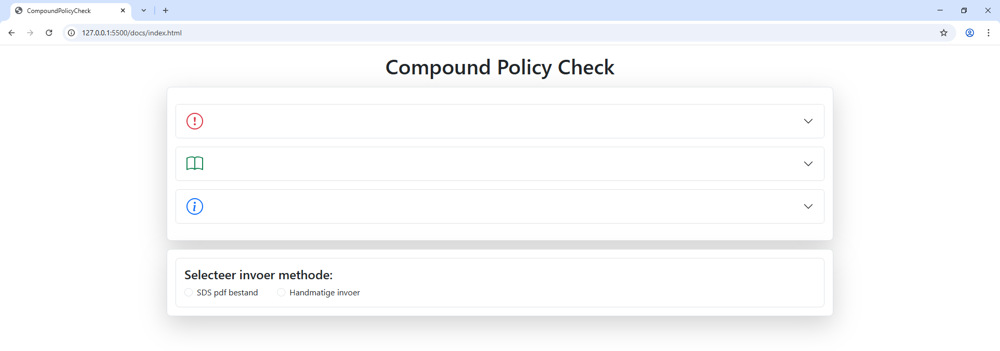
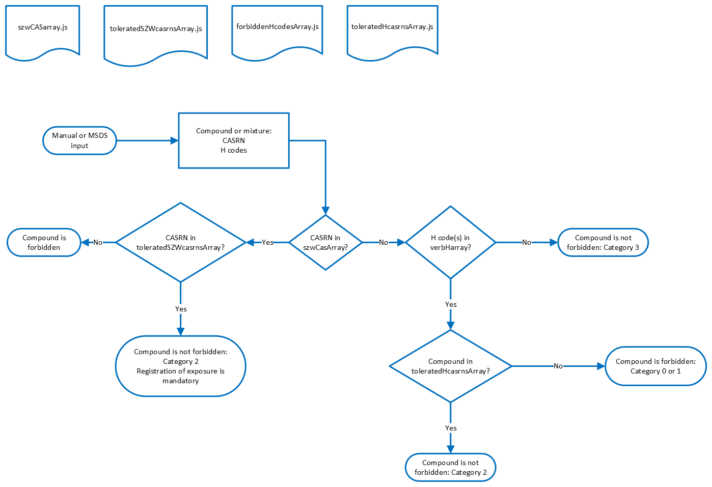

# Compound Policy Check App (cpc app)


## <a id='toc'>Table of Contents</a>

- [Problem Statement](#problem-statement)
- [Why This Project?](#why-this-project)
- [Project Overview](#project-overview)    
    - [Functionality](#functionality)
    - [Features](#features)
    - [Boundary Conditions](#boundary-conditions)
    - [Usage Instructions](#usage-instructions)
    - [Skills Applied](#skills-applied)
    - [Researched Topics](#researched-topics)
- [How It Works](#how-it-works)
    - [The User Interface](#ui)
    - [Directory Structure](#directory-structure)
    - [MVC Design Pattern](#mvc-design-pattern)
    - [Decision Tree](#decision-tree)
    - [Application Workflow](#application-workflow)
- [Resources](#resources)
- [License](#license)

## <a id='problem-statement'>Problem Statement</a> [&uarr;](#toc)

Chemical substances—whether pure compounds or mixtures—are subject to strict regulations to prevent environmental harm and protect human health. In the European Union (EU), two key regulatory frameworks govern these substances:

- **REACH** (Registration, Evaluation, Authorisation and Restriction of Chemicals), which applies to all chemical substances.
- **CLP** (Classification, Labelling and Packaging), which aligns EU classification and labelling with the UN’s **Globally Harmonized System (GHS)**.

The **European Chemicals Agency (ECHA)** oversees the implementation of these regulations. A critical component of CLP is the **Harmonized Classification and Labelling (CLH)** system, which ensures consistent risk management for substances of high concern—such as carcinogenic, mutagenic, and reprotoxic chemicals (CMR). Manufacturers, importers, and downstream users are required to adhere to CLH classifications.

If applicable, a chemical is assigned:
- A **GHS hazard pictogram** for visual hazard recognition.
- One or more **H (Hazard)** and **P (Precautionary)** statements, which describe the nature of the hazard and recommended safety measures.

These statements follow a standardized format:
- **HXXX** codes for hazards (e.g., H2XX for physical hazards, H3XX for health, H4XX for environmental).
- **PXXX** codes for precautions (e.g., P1XX for general, P2XX for prevention, P3XX for reaction, P4XX for storage, and P5XX for disposal).

Because scientific understanding evolves, these classifications for chemical compounds are regularly updated. In the Netherlands, the *Ministerie van Sociale Zaken en Werkgelegenheid (SZW)* publishes a biannual list of CMR substances—currently around 900 entries—identified by name and **CAS Registry Number (CAS RN)**, a unique identifier for chemical substances.

---

In the laboratory where I work, this regulatory information is used to **restrict or exclude** certain chemicals. The lab manages:
- ~1,000 chemical containers
- 500+ active users
- A custom categorization system based on H statements and CAS RNs:

| Category | Description |
|----------|-------------|
| Cat. 0   | Not allowed |
| Cat. 1   | Temporarily allowed |
| Cat. 2   | Allowed but hazardous |
| Cat. 3   | No acute hazards |

When a chemical is used or ordered, its H statements and CAS RN must be checked against internal lists to determine its category. This manual lookup process is **time-consuming and error-prone**.

---

### <a id='why-this-project'>Why This Project?</a> [&uarr;](#toc)

This project automates the classification process—freeing up time for actual research and reducing the risk of human error. Computers excel at repetitive, rule-based tasks, making them ideal for this kind of regulatory compliance work.

---

## <a id='project-overview'>Project Overview</a> [&uarr;](#toc)

### <a id='functionality'>Functionality</a> [&uarr;](#toc)

The user can input a Safety Data Sheet (SDS) PDF containing the H statements and CAS RNs or can manually enter H statements and CAS RNs. The PDF is processed, and all H statements and CAS RNs are extracted. H statements and CAS RNs from either the SDS or manual input are checked for validity, then looked up in the list of forbidden H statements and CAS RNs. After processing, the user receives a report on entered substances (CAS RNs) and/or H statements. For each entry, a verdict is given in the form of a category number and whether the substance is 'forbidden' or 'not forbidden'. Note that the latter is not the same as 'allowed' since a chemical substance that does not meet the criteria to be forbidden can still be banned from the lab, e.g. a drug precursors etc.

### <a id='features'>Features</a> [&uarr;](#toc)

- Manual input and file upload
- Cross-platform compatibility
- Integration with institutional portals (e.g. SharePoint (on-premises))
- Verification and validation of user input (valid H statements, CAS RNs, and correct file format)
- Attractive and intuitive user interface
- Easily updatable with biannual SZW CMR CAS RN list

### <a id='boundary-conditions'>Boundary Conditions</a> [&uarr;](#toc)

For historical reasons, the program runs on the client side only, as the institution's portal back-end was not accessible and could not be modified. The program was designed to run in the client's browser using HTML5, CSS, and JavaScript. With the institution's migration to SharePoint Online (SPO) and restrictions on serving custom pages with scripts, the program is now served as a static page via GitHub, maintaining the look and feel of a highly interactive site.

### <a id='usage-instructions'>Usage Instructions</a> [&uarr;](#toc)

The program runs in the user's browser and can be made available via portals like SharePoint (on-premises), or served using services like GitHub. To maintain the application, the SZW list of CMR CAS RNs must be retrieved and extracted every six months. A dedicated Python 3.x and Typer CLI application handles this task, extracting CAS RNs, checking their validity, and converting them into a JavaScript array. The CLI app also generates a watchlist for the institution's chemical inventory system, removing tolerated substances from the SZW list.  This CLI app is not included in this repo yet.

### <a id='skills-applied'>Skills Applied</a> [&uarr;](#toc)

- Solution strategy finding to integrate the program into the institution's portal
- Python: Retrieving websites, extracting information, and outputting as JavaScript
- JavaScript: Processing uploaded files
- Writing effective and solid regular expressions
- Bootstrap 5 form validation

### <a id='researched-topics'>Researched Topics</a> [&uarr;](#toc)

- JavaScript
- Python
- CSS, specifically Bootstrap 5
- HTML5 forms
- Browser compatibility
- Regular expressions in Python and JavaScript
- Understanding the institution's portal

## <a id='how-it-works'>How It Works</a> [&uarr;](#toc)

This section shows a screenshot, the app directory structure, and describes the mechanics of this app.

### <a id='ui'>The User Interface</a> [&uarr;](#toc)

<figure>
    
    <figcaption>
        Screenshot showing the UI of the app. The three sections marked with an exclamation mark, book symbol, and information symbol can be expanded to reveal text with instruction or information on app usage. The lower part shows the file upload and manual input forms. The manual input will expand upon selection to enter CAS RNs, H codes, and or P codes. 
    </figcaption>
</figure>


### <a id='directory-structure'>Directory Structure</a> [&uarr;](#toc)

The directory structure of the cpc app is:

<pre>
│   index.html
│
├───css
│       bootstrap.min.css
│       styles.css
│
├───ghsPictograms
│       GHS-pictogram-acid.svg
│       GHS-pictogram-bottle.svg
│       GHS-pictogram-exclam.svg
│       GHS-pictogram-explos.svg
│       GHS-pictogram-flamme.svg
│       GHS-pictogram-none.svg
│       GHS-pictogram-pollu.svg
│       GHS-pictogram-rondflam.svg
│       GHS-pictogram-silhouette.svg
│       GHS-pictogram-skull.svg
│
├───images
│       bootstrap-icons.svg
│       flask-fill.svg
│
└───js
        checkAllowanceAndGetVerdict.js
        controller.js
        createReport.js
        extractCasHandPfromString.js
        extractInputPDF.js
        forbiddenHcodesArray.js
        idGenerator.js
        onloadAndFormFuncs.js
        pdf.js
        pdf.worker.js
        stmts.js
        szwCASarray.js
        toleratedHcasrnsArray.js
        toleratedSZWcasrnsArray.js
</pre>

### <a id='mvc-design-pattern'>MVC Design Pattern</a> [&uarr;](#toc)

*index.html* is the UI of the app with which the user interacts and via which results are viewed. In addition to *controller.js*, the HTML file is part of the Controller but is also the View. *onloadAndFormFuncs.js* handles registering the event handlers and does some DOM manipulation. Additionally, it handles the user input data from the form and passes it to the controller script and then clears the form fields. Here each form, i.e., file or manual input, is checked before it is "submitted", so the user-entered data is pre-processed by *onloadAndFormFuncs.js*. Custom form validation is applied to check for CASRN, H, and P code validity via regexes. Validation of CASRNs happens through `checkCasValidity()` and for H and P codes through `checkHphraseValidity()` and `checkPphraseValidity()` respectively. The latter function looks up the values in *stmts.js*. Since no back-end scripts are run, validation can only be done client-side. *onloadAndFormFuncs.js* interacts with *controller.js* which receives the pre-processed input arrays from the HTML form, assembles a report, and puts it into the DOM.

The Model is contained in the PDF and data processing scripts, and library scripts. The PDF processing is done by *Ppdf.js* and by *extractInputPDF.js*. The data processing happens through *idGenerator.js*, *createReport.js*, and *checkAllowanceAndGetVerdict.js*. Library scripts are *stmts.js*, *szwCASarray.js*, *forbiddenHcodesArray.js*, *toleratedHcasrnsArray.js*, and *toleratedSZWcasrnsArray.js*. The library scripts are all Python generated.

### <a id='decision-tree'>Decision Tree</a> [&uarr;](#toc)

Before proceeding to a detailed description of the internal workflow of the app that implements all the business logic, it may help the reader to have an overview of the application logic in the form of a decision tree, see below.

<figure>
    
    <figcaption>Decision tree showing the business logic of the Compound Policy Check app. The upper row represents library files that are used to look up values.</figcaption>
</figure>


### <a id='application-workflow'>Application Workflow</a> [&uarr;](#toc)

Typically, this app works as follows: In case of a file input, i.e., a Safety Data Sheet as PDF, is submitted and processed in *onLoadAndFormFuncs.js*. *onLoadAndFormFuncs.js* then passes this array:

```javascript
["PDF filename", "PDF text as a string"]
```

to `processFileInput()` in *controller.js*. `processFileInput()` passes the array to `searchCasHandP.PDFInput()` in *extractCasHandPfromString.js*. The IIFE `searchCasHandP` processes the string: it extracts all available valid CAS RNs, H codes, and P codes, using regular expressions, and returns a multi-dimensional array:

```javascript
["PDF filename", ["CAS RNs", ...], ["H codes", ...], ["P codes", ...]]
```

Example of a return value of `searchCasHandP.PDFInput()`:

```javascript
[
  "7240-90-6.PDF",
  [
    "7240-90-6"
  ],
  [
    "H302",
    "H312",
    "H332"
  ],
  [
    "P261",
    "P264",
    "P270",
    "P271",
    "P330",
    "P301+P312",
    "P302+P352",
    "P304+P340",
    "P362+P364"
  ]
]
```

The resulting multi-dimensional array is then passed by *controller.js* to the `createReportAndPutInDOM` function. The multi-dimensional array could also have been obtained directly from *onLoadAndFormFuncs.js* in case of manual input. The array would then have "handmatig" instead of "PDF filename". This is possible since all the form fields have custom validity checks on them and the pre-processed data should be sane.

Within `createReportAndPutInDOM`, an object compound is created that is an instance of the `Compound` class defined in *checkAllowanceAndgetVerdict.js*. This class uses the library files to do all the checks on data from user input. The constructor inside this class defines the object properties that are in turn derived from its methods. The methods do all the hard work in terms of checking if CAS RN(s) appear(s) in the SZW (forbidden CAS RNs list) or in the lists of tolerated CAS RNs. If the latter is true then it overrules the former, i.e category 2 instead of 0. Likewise the H code(s) is/are checked if it/they appear(s) in the list of forbidden H codes. If so, then the substance is not allowed. On the other hand if the H code belongs to a CAS RN that is tolerated, then the substance is allowed. So the CAS RN takes precedence over H code. Therefore, this app differentiates between overriding, i.e. tolerating, SZW or H code exclusion. Additionally, for each H and P code the phrases are looked up. For H codes the name of the GHS pictogram is retrieved. A final verdict on whether a substance is forbidden or not forbidden is given. Note that if a compound does not appear on the SZW list and does not have any forbidden H codes then it is assigned to be category 3. An example of the compound object is:

```javascript
{
  "input": "7240-90-6.PDF",
  "casrns": [
    {
      "casrn": "7240-90-6",
      "text": "Niet verboden op basis van CASRN want komt niet voor in de SZW lijst.",
      "allowed": true,
      "category": 3
    }
  ],
  "hPhrases": [
    {
      "H302": {
        "appliesTo": "Acute orale toxiciteit, gevarencategorie 4.",
        "phrase": "Schadelijk bij inslikken.",
        "picto": [
          "exclam"
        ]
      },
      "allowed": true
    },
    {
      "H312": {
        "appliesTo": "Acute dermale toxiciteit, gevarencategorie 4.",
        "phrase": "Schadelijk bij contact met de huid.",
        "picto": [
          "exclam"
        ]
      },
      "allowed": true
    },
    {
      "H332": {
        "appliesTo": "Acute toxiciteit bij inademing, gevarencategorie 4.",
        "phrase": "Schadelijk bij inademing.",
        "picto": [
          "exclam"
        ]
      },
      "allowed": true
    }
  ],
  "pPhrases": [
    {
      "P261": "Inademing van stof/rook/gas/nevel/damp/spuitnevel vermijden."
    },
    {
      "P264": "Na het werken met dit product ... grondig wassen."
    },
    {
      "P270": "Niet eten, drinken of roken tijdens het gebruik van dit product."
    },
    {
      "P271": "Alleen buiten of in een goed geventileerde ruimte gebruiken."
    },
    {
      "P330": "De mond spoelen."
    },
    {
      "P301+P312": "NA INSLIKKEN: bij onwel voelen een ANTIGIFCENTRUM/arts/... raadplegen."
    },
    {
      "P302+P352": "BIJ CONTACT MET DE HUID: met veel water en zeep wassen."
    },
    {
      "P304+P340": "NA INADEMING: de persoon in de frisse lucht brengen en ervoor zorgen dat deze gemakkelijk kan ademen."
    },
    {
      "P362+P364": "Verontreinigde kleding uittrekken en wassen alvorens deze opnieuw te gebruiken."
    }
  ],
  "allowed": {
    "verdictMessage": "Deze stof is niet verboden.",
    "allowed": true
  }
}
```

Now that everything is in place the Controller generates a View by creating a compound DOM element derived from the `CompoundReport` class defined in *createReport.js*. The `CompoundReport` class accepts a compound object. When the compound DOM element object is instantiated, HTML elements are generated from all the property values of the compound object. The HTML elements are then appended to a tree within an HTML div element. This div element is then appended to the `id=divCompounds` div element in the body of the HTML document. The user can now inspect the generated report, i.e. the View. Multiple reports can be stacked within the DOM and can be removed individually.

To make this app work on the portal of the institution (Microsoft IIS), I just changed the file extensions of the `html` file to `aspx` and it worked! BTW: Later in a conversation with someone from the IT department this turned out to be a serious security flaw they were not aware of!

# <a id='resources'>Resources</a> [&uarr;](#toc)

For this project I used many resources and the least I can do is refer to them. Without these resources and bright teachers I would never have come this far! So here's a list in random order.

- PY4E by Charles Severance (online open course and book on Python)
- JavaScript by Peter Kassenaar (book)
- The Coding Train (YouTube videos on JavaScript, particularly ES6, promises, etc.)
- WebDev Simplified for JavaScript
- StackOverflow (many posts)
- Corey Schafer (Python YouTube videos, particularly on virtual environments)
- MDN Web Docs for JavaScript (https://developer.mozilla.org/en-US/docs/Web/JavaScript)
- https://mozilla.github.io/PDF.js/ (PDF handling)
- https://regex101.com/ for testing my regular expressions (this site rocks!)
- SZW CASRN data (https://zoek.officielebekendmakingen.nl/stcrt-2022-51.html)
- Wiki page on H and P phrases (https://nl.wikipedia.org/wiki/Lijst_van_H-_en_P-zinnen)
- Bootstrap documentation (https://getbootstrap.com/)
- Traversy Media YouTube videos on Bootstrap

## <a id='license'>License</a> [&uarr;](#toc)

This project is licensed under the GNU General Public License v3.0.
